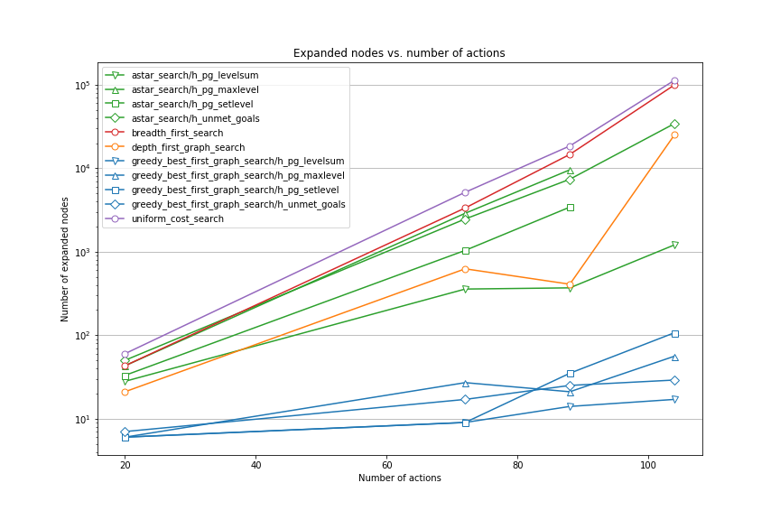
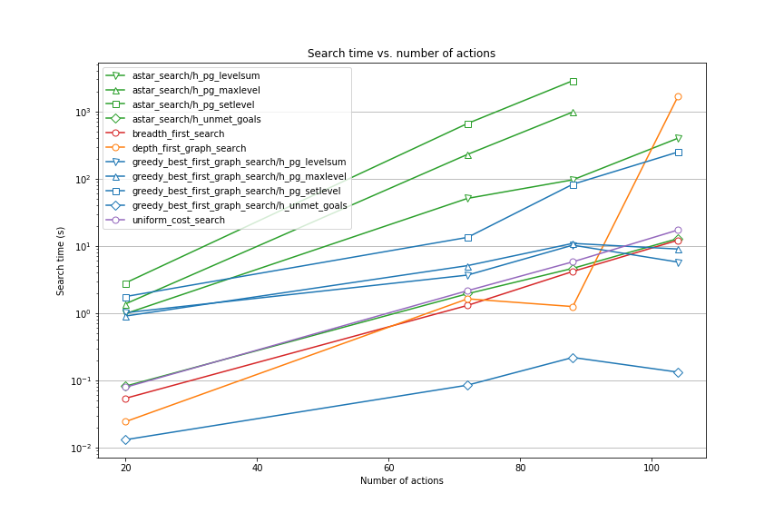
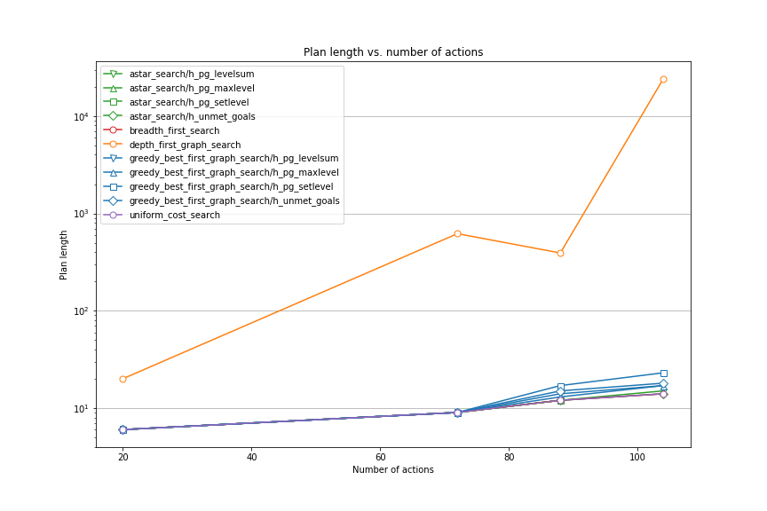
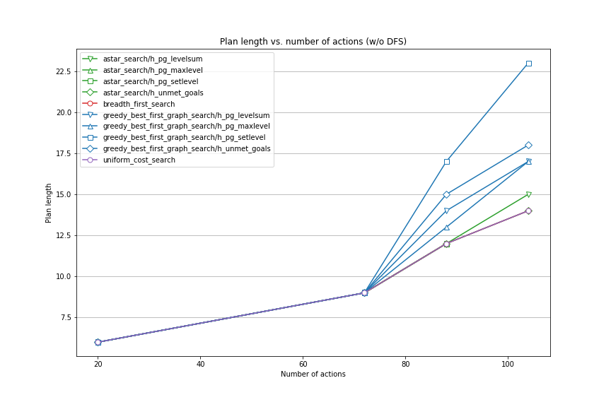

# Project Report: _Build a Forward Planning Agent_

Oliver Koch, 3. May 2020

## Introduction

All runs were performed locally on a Linux machine using pypy. 
I attempted to run all algorithms on all problems. 
I stopped A* searches with set-level and max-level heuristics on air crago problem 4 
after approximately 2 hours. All other runs yielded results.
The full set of results is shown in the table at the end of the report.

The diagrams below show number ox expansions, search time and length of plan versions number of actions.
The number of actions is determined by the problem, see table.

| Air Cargo Problem | Number of actions |
| --- | --- |
| 1 | 20 |
| 2 | 72 |
| 3 | 88 |
| 4 | 104 |

## Number of expansions

## Search time

Although A* search variants expands less nodes than BFS/UCS (see figure above),
there is no advantage
in search time compared to BFS/UCS for heuristics using a planning graph
(this may be due to my inefficient implementation of the planning graph). 

## Plan length

In the first diagram, the very long plans resulting from depth first search 
dominate and suppress the differences between other algorithms. 
The second diagram shows the plan length of all algorithms except depth first 
search.

## Question 1: _Which algorithm or algorithms would be most appropriate for planning in a very restricted domain (i.e., one that has only a few actions) and needs to operate in real time?_

Air cargo problem 1 with 20 actions is used as an example for is kind of problems. 
For this task, space complexity is not relevant. Optimality would be nice but is not required. 

__Greedy best first graph search__ with the unmet-gols heuristic has the lowest search time (0.013 s) 
and would be my first choice for such a situation.
The next fastest algorithm is depth-first-search (0.024 s). However, the generated plan is not 
optimal (20 vs. 6 steps), and I would not use this algorithm. 
BFS, UCS with might still be acceptable (search time < 0.1 s), if optimality is required and 
depending on the time available for computation.

## Question 2: _Which algorithm or algorithms would be most appropriate for planning in very large domains (e.g., planning delivery routes for all UPS drivers in the U.S. on a given day)?_

For this kind of problem, low space complexity is required. BFS, DFS and A* are therefore impractial.
__Greedy best-first search__ is an approriate algorithm. 

According to the AIMA book, also "___RBFS (recursive best-first search)___ _and_ ___SMA∗ (simplified memory-bounded A∗)___ _are robust, optimal search algorithms that use limited amounts of memory_".

## Question 3: _Which algorithm or algorithms would be most appropriate for planning problems where it is important to find only optimal plans?_

__Breadth-first search__, __Uniform Cost Search__ and __A*-Search__(with admissible/consistent heuristics) are optimal. 
Of the heuristics used here, __max-level__ and __set-level__ are consistent.

According to the AIMA book, also "___RBFS (recursive best-first search)___ _and_ ___SMA∗ (simplified memory-bounded A∗)___ _are robust, optimal search algorithms that use limited amounts of memory_".

## Appendix: Results of all program runs

<table border="1" class="dataframe">
  <thead>
    <tr style="text-align: right;">
      <th>problem</th>
      <th>actions</th>
      <th>algorithm</th>
      <th>heuristic</th>
      <th>expansions</th>
      <th>goal_tests</th>
      <th>new_nodes</th>
      <th>plan_length</th>
      <th>time</th>
    </tr>
  </thead>
  <tbody>
    <tr>
      <td>1</td>
      <td>20</td>
      <td>breadth_first_search</td>
      <td></td>
      <td>43</td>
      <td>56</td>
      <td>178</td>
      <td>6</td>
      <td>0.054103</td>
    </tr>
    <tr>
      <td>1</td>
      <td>20</td>
      <td>depth_first_graph_search</td>
      <td></td>
      <td>21</td>
      <td>22</td>
      <td>84</td>
      <td>20</td>
      <td>0.024324</td>
    </tr>
    <tr>
      <td>1</td>
      <td>20</td>
      <td>uniform_cost_search</td>
      <td></td>
      <td>60</td>
      <td>62</td>
      <td>240</td>
      <td>6</td>
      <td>0.079008</td>
    </tr>
    <tr>
      <td>1</td>
      <td>20</td>
      <td>greedy_best_first_graph_search</td>
      <td>h_unmet_goals</td>
      <td>7</td>
      <td>9</td>
      <td>29</td>
      <td>6</td>
      <td>0.013098</td>
    </tr>
    <tr>
      <td>1</td>
      <td>20</td>
      <td>greedy_best_first_graph_search</td>
      <td>h_pg_levelsum</td>
      <td>6</td>
      <td>8</td>
      <td>28</td>
      <td>6</td>
      <td>1.015349</td>
    </tr>
    <tr>
      <td>1</td>
      <td>20</td>
      <td>greedy_best_first_graph_search</td>
      <td>h_pg_maxlevel</td>
      <td>6</td>
      <td>8</td>
      <td>24</td>
      <td>6</td>
      <td>0.905682</td>
    </tr>
    <tr>
      <td>1</td>
      <td>20</td>
      <td>greedy_best_first_graph_search</td>
      <td>h_pg_setlevel</td>
      <td>6</td>
      <td>8</td>
      <td>28</td>
      <td>6</td>
      <td>1.766840</td>
    </tr>
    <tr>
      <td>1</td>
      <td>20</td>
      <td>astar_search</td>
      <td>h_unmet_goals</td>
      <td>50</td>
      <td>52</td>
      <td>206</td>
      <td>6</td>
      <td>0.082072</td>
    </tr>
    <tr>
      <td>1</td>
      <td>20</td>
      <td>astar_search</td>
      <td>h_pg_levelsum</td>
      <td>28</td>
      <td>30</td>
      <td>122</td>
      <td>6</td>
      <td>0.982791</td>
    </tr>
    <tr>
      <td>1</td>
      <td>20</td>
      <td>astar_search</td>
      <td>h_pg_maxlevel</td>
      <td>43</td>
      <td>45</td>
      <td>180</td>
      <td>6</td>
      <td>1.376201</td>
    </tr>
    <tr>
      <td>1</td>
      <td>20</td>
      <td>astar_search</td>
      <td>h_pg_setlevel</td>
      <td>33</td>
      <td>35</td>
      <td>138</td>
      <td>6</td>
      <td>2.821826</td>
    </tr>
    <tr>
      <td>2</td>
      <td>72</td>
      <td>breadth_first_search</td>
      <td></td>
      <td>3343</td>
      <td>4609</td>
      <td>30503</td>
      <td>9</td>
      <td>1.303654</td>
    </tr>
    <tr>
      <td>2</td>
      <td>72</td>
      <td>depth_first_graph_search</td>
      <td></td>
      <td>624</td>
      <td>625</td>
      <td>5602</td>
      <td>619</td>
      <td>1.632375</td>
    </tr>
    <tr>
      <td>2</td>
      <td>72</td>
      <td>uniform_cost_search</td>
      <td></td>
      <td>5154</td>
      <td>5156</td>
      <td>46618</td>
      <td>9</td>
      <td>2.158004</td>
    </tr>
    <tr>
      <td>2</td>
      <td>72</td>
      <td>greedy_best_first_graph_search</td>
      <td>h_unmet_goals</td>
      <td>17</td>
      <td>19</td>
      <td>170</td>
      <td>9</td>
      <td>0.084858</td>
    </tr>
    <tr>
      <td>2</td>
      <td>72</td>
      <td>greedy_best_first_graph_search</td>
      <td>h_pg_levelsum</td>
      <td>9</td>
      <td>11</td>
      <td>86</td>
      <td>9</td>
      <td>3.683189</td>
    </tr>
    <tr>
      <td>2</td>
      <td>72</td>
      <td>greedy_best_first_graph_search</td>
      <td>h_pg_maxlevel</td>
      <td>27</td>
      <td>29</td>
      <td>249</td>
      <td>9</td>
      <td>5.093418</td>
    </tr>
    <tr>
      <td>2</td>
      <td>72</td>
      <td>greedy_best_first_graph_search</td>
      <td>h_pg_setlevel</td>
      <td>9</td>
      <td>11</td>
      <td>84</td>
      <td>9</td>
      <td>13.405654</td>
    </tr>
    <tr>
      <td>2</td>
      <td>72</td>
      <td>astar_search</td>
      <td>h_unmet_goals</td>
      <td>2467</td>
      <td>2469</td>
      <td>22522</td>
      <td>9</td>
      <td>1.944583</td>
    </tr>
    <tr>
      <td>2</td>
      <td>72</td>
      <td>astar_search</td>
      <td>h_pg_levelsum</td>
      <td>357</td>
      <td>359</td>
      <td>3426</td>
      <td>9</td>
      <td>50.998801</td>
    </tr>
    <tr>
      <td>2</td>
      <td>72</td>
      <td>astar_search</td>
      <td>h_pg_maxlevel</td>
      <td>2887</td>
      <td>2889</td>
      <td>26594</td>
      <td>9</td>
      <td>230.146767</td>
    </tr>
    <tr>
      <td>2</td>
      <td>72</td>
      <td>astar_search</td>
      <td>h_pg_setlevel</td>
      <td>1037</td>
      <td>1039</td>
      <td>9605</td>
      <td>9</td>
      <td>663.803041</td>
    </tr>
    <tr>
      <td>3</td>
      <td>88</td>
      <td>breadth_first_search</td>
      <td></td>
      <td>14663</td>
      <td>18098</td>
      <td>129625</td>
      <td>12</td>
      <td>4.166022</td>
    </tr>
    <tr>
      <td>3</td>
      <td>88</td>
      <td>depth_first_graph_search</td>
      <td></td>
      <td>408</td>
      <td>409</td>
      <td>3364</td>
      <td>392</td>
      <td>1.252732</td>
    </tr>
    <tr>
      <td>3</td>
      <td>88</td>
      <td>uniform_cost_search</td>
      <td></td>
      <td>18510</td>
      <td>18512</td>
      <td>161936</td>
      <td>12</td>
      <td>5.799185</td>
    </tr>
    <tr>
      <td>3</td>
      <td>88</td>
      <td>greedy_best_first_graph_search</td>
      <td>h_unmet_goals</td>
      <td>25</td>
      <td>27</td>
      <td>230</td>
      <td>15</td>
      <td>0.219061</td>
    </tr>
    <tr>
      <td>3</td>
      <td>88</td>
      <td>greedy_best_first_graph_search</td>
      <td>h_pg_levelsum</td>
      <td>14</td>
      <td>16</td>
      <td>126</td>
      <td>14</td>
      <td>10.267711</td>
    </tr>
    <tr>
      <td>3</td>
      <td>88</td>
      <td>greedy_best_first_graph_search</td>
      <td>h_pg_maxlevel</td>
      <td>21</td>
      <td>23</td>
      <td>195</td>
      <td>13</td>
      <td>10.906227</td>
    </tr>
    <tr>
      <td>3</td>
      <td>88</td>
      <td>greedy_best_first_graph_search</td>
      <td>h_pg_setlevel</td>
      <td>35</td>
      <td>37</td>
      <td>345</td>
      <td>17</td>
      <td>82.663379</td>
    </tr>
    <tr>
      <td>3</td>
      <td>88</td>
      <td>astar_search</td>
      <td>h_unmet_goals</td>
      <td>7388</td>
      <td>7390</td>
      <td>65711</td>
      <td>12</td>
      <td>4.637515</td>
    </tr>
    <tr>
      <td>3</td>
      <td>88</td>
      <td>astar_search</td>
      <td>h_pg_levelsum</td>
      <td>369</td>
      <td>371</td>
      <td>3403</td>
      <td>12</td>
      <td>96.208736</td>
    </tr>
    <tr>
      <td>3</td>
      <td>88</td>
      <td>astar_search</td>
      <td>h_pg_maxlevel</td>
      <td>9580</td>
      <td>9582</td>
      <td>86312</td>
      <td>12</td>
      <td>982.185796</td>
    </tr>
    <tr>
      <td>3</td>
      <td>88</td>
      <td>astar_search</td>
      <td>h_pg_setlevel</td>
      <td>3423</td>
      <td>3425</td>
      <td>31596</td>
      <td>12</td>
      <td>2872.003272</td>
    </tr>
    <tr>
      <td>4</td>
      <td>104</td>
      <td>breadth_first_search</td>
      <td></td>
      <td>99736</td>
      <td>114953</td>
      <td>944130</td>
      <td>14</td>
      <td>12.160438</td>
    </tr>
    <tr>
      <td>4</td>
      <td>104</td>
      <td>depth_first_graph_search</td>
      <td></td>
      <td>25174</td>
      <td>25175</td>
      <td>228849</td>
      <td>24132</td>
      <td>1677.166702</td>
    </tr>
    <tr>
      <td>4</td>
      <td>104</td>
      <td>uniform_cost_search</td>
      <td></td>
      <td>113339</td>
      <td>113341</td>
      <td>1066413</td>
      <td>14</td>
      <td>17.259971</td>
    </tr>
    <tr>
      <td>4</td>
      <td>104</td>
      <td>greedy_best_first_graph_search</td>
      <td>h_unmet_goals</td>
      <td>29</td>
      <td>31</td>
      <td>280</td>
      <td>18</td>
      <td>0.132494</td>
    </tr>
    <tr>
      <td>4</td>
      <td>104</td>
      <td>greedy_best_first_graph_search</td>
      <td>h_pg_levelsum</td>
      <td>17</td>
      <td>19</td>
      <td>165</td>
      <td>17</td>
      <td>5.751898</td>
    </tr>
    <tr>
      <td>4</td>
      <td>104</td>
      <td>greedy_best_first_graph_search</td>
      <td>h_pg_maxlevel</td>
      <td>56</td>
      <td>58</td>
      <td>580</td>
      <td>17</td>
      <td>8.994136</td>
    </tr>
    <tr>
      <td>4</td>
      <td>104</td>
      <td>greedy_best_first_graph_search</td>
      <td>h_pg_setlevel</td>
      <td>107</td>
      <td>109</td>
      <td>1164</td>
      <td>23</td>
      <td>249.458142</td>
    </tr>
    <tr>
      <td>4</td>
      <td>104</td>
      <td>astar_search</td>
      <td>h_unmet_goals</td>
      <td>34330</td>
      <td>34332</td>
      <td>328509</td>
      <td>14</td>
      <td>12.858093</td>
    </tr>
    <tr>
      <td>4</td>
      <td>104</td>
      <td>astar_search</td>
      <td>h_pg_levelsum</td>
      <td>1208</td>
      <td>1210</td>
      <td>12210</td>
      <td>15</td>
      <td>400.510749</td>
    </tr>
  </tbody>
</table>
